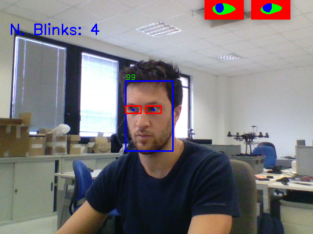

# eye_blink_detector

This package contains a modular pipeline written in C++ to perform eye blink detection in real-time from a video stream. 

The pipeline is based on modules to focus on the aspect of the eye over the time and detect blinks, in particular, the main components are: face detector, eye feature extractor and classifier working sequentially. Custom implementation is possible and the package contains:
- SSD to detect faces and their eye landmarks in the image
- Unet to estimate the eye segmentations, representing features
- LSTM based classifier to detect blinks

The application runs fully on CPU at 44 FPS on i7-8750H.

<p align="center">
  
</p>

## Compilation
The project is based on three main dependences:
- [OpenCV (and OpenCV DNN module)](https://github.com/opencv)

  install it either from source following [this](https://github.com/opencv/opencv_contrib#readme) or with apt.
  
- [libfacedetection](https://github.com/ShiqiYu/libfacedetection)

  clone the libfacedetection repo and compile as shared lib
  
  ```
  cd <path-to-eye_blink_detection-folder>
  mkdir ThirdParty && cd ThirdParty
  git clone https://github.com/ShiqiYu/libfacedetection
  cd libfacedetection 
  mkdir build && cd build
  cmake -DBUILD_SHARED_LIBS=ON -DCMAKE_BUILD_TYPE=Release ..
  make
  ```
- [yaml-cpp](https://github.com/jbeder/yaml-cpp)

  clone the libfacedetection repo and compile as shared lib
  
  ```
  - cd <path-to-eye_blink_detection-folder>
  - cd ThirdParty
  - git clone https://github.com/jbeder/yaml-cpp
  - cd yaml-cpp 
  - mkdir build && cd build
  - cmake -DYAML_BUILD_SHARED_LIBS=ON ..
  - make
  ```
  
Once you have compiled the dependeces, the package can be compiled with:

 ```
 - cd <path-to-eye_blink_detection-folder>
 - mkdir build && cd build
 - cmake ..
 - make
 ```
 
## Example
You can run the application through the executable main with the proper config file:

```
./main <path-to-eye_blink_detection-folder>/cfg/eb_detector.yaml
```
