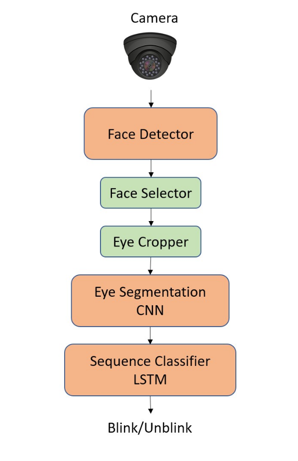

# eye_blink_detector
This package contains a modular pipeline of deep learning models to perform eye blink detection in real-time from a video stream. It is based on a face detector, which detects all the faces in the current frame. Only one is analyzed computing the segmentations of both eyes, which will be the input to the final blink classifier

## Table of Contents
- [Classification pipeline](#packages)
- [Installation](#installation)

## Classification pipeline

# Face detector
Every frame of the video stream is set as input to a face detector, which outputs the boundind boxes of all the faces present in the image and, for each of them 5 landmarks corresponds. Among all the faces, only one is selected and a squared 
